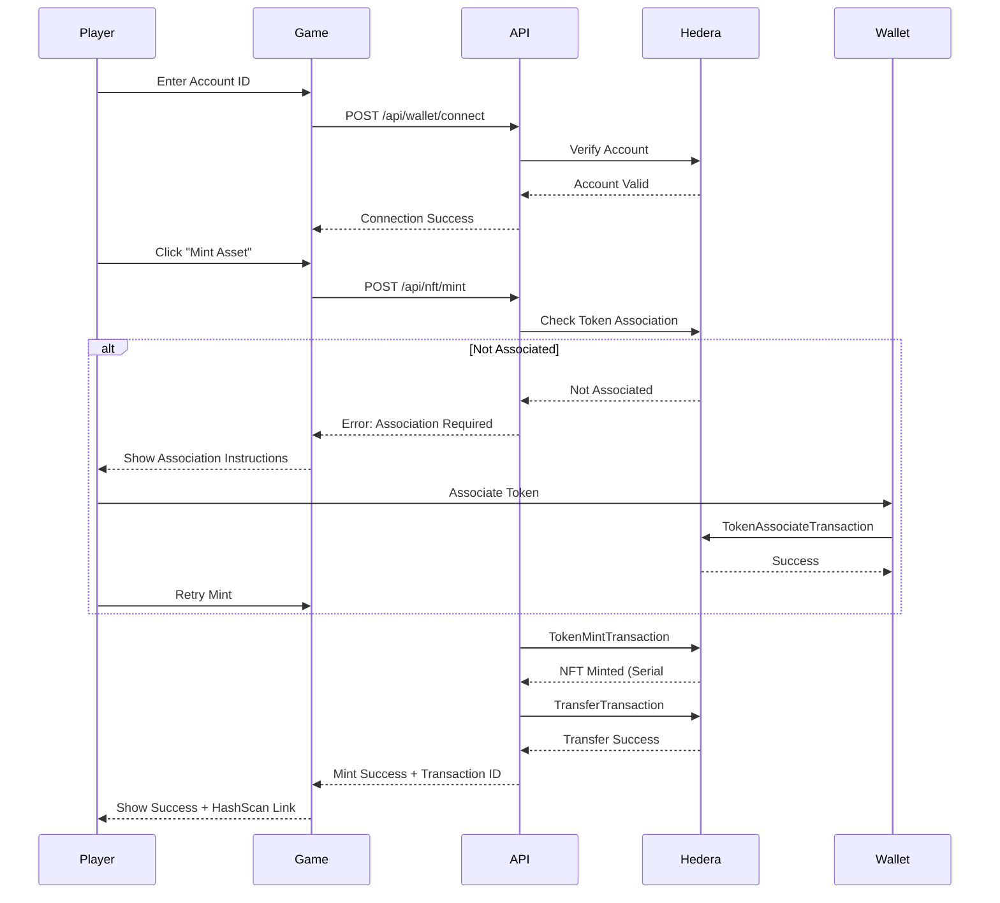

# Beyond Service: Hedera-Powered Action RPG

**Project Title:** Beyond Service   
**Hackathon Track:** African Metaverse Worlds

## 🚀 Project Overview

**Beyond Service** is a an action adventure RPG franchise blending Souls-like combat with mythic storytelling inspired by Nigerian folklore. Our hackathon submission demonstrates a secure, production-ready integration with the Hedera network to deliver verifiable digital ownership and a foundation for a player-driven economy.

Our project is a **Prototype (TRL 4-6)**, showcasing an end-to-end working feature: **Secure Wallet Connection and Exclusive NFT Minting (utilised as ingame assets for gameplay)**.

## 🌍 Hedera Integration Summary (The Why)

We chose Hedera for its **low, predictable fees** and **ABFT finality**, which are essential for building a sustainable and trustworthy economy for African gamers.

| Hedera Service Used | Implementation | Economic Justification |
| :--- | :--- | :--- |
| **Hedera Token Service (HTS)** | Used to create the exclusive in-game assets as Non-Fungible Tokens (NFTs). The backend mints these tokens directly to the player's verified Hedera Testnet Account ID. | **Low, Predictable Fees:** Ensures that the cost of minting an exclusive in-game asset remains negligible for both the player and the game studio, making the P2E model economically sustainable even at high volume. |
| **Hedera Account Service** | Used for wallet connection and verification. The backend uses the player's Account ID to verify existence and check eligibility for NFT minting. | **Security & Trust:** By using Hedera accounts, we leverage the network's security model, eliminating the need for players to share sensitive private keys, thereby building a secure and trustworthy foundation for our African user base. |

### Specific Hedera Transactions Executed (MVP)

*   `TokenCreateTransaction`
*   `TokenMintTransaction`
*   `TransferTransaction`
*   `AccountInfoQuery`

## ⚙️ Setup & Architecture

This repository is structured as a mono-repo:
1.  **`hedera-game-backend/`**: The Node.js API backend (See `API_README.md` for setup).
2.  **`unreal-client/`**: The Unreal Engine game client (sub-repository - See `unreal-client/README.md`).

### Architecture Diagram

The system operates as a secure proxy, shielding the private keys from the client while leveraging Hedera for verifiable ownership.

## 🔑 Deployed Hedera IDs

| ID Type | ID / Key | Description |
| :--- | :--- | :--- |
| **Treasury Account ID** | `0.0.7098468` | Account used to pay for transaction fees and sign minting transactions. |
| **NFT Token ID** | `0.0.7109238` | The unique ID for the "Beyond Service Exclusive Asset" collection. |

## 🎮 User Flow: Connecting Wallet & Minting NFTs

### Prerequisites for Players

Before a player can mint an exclusive game asset, they must:

1.  **Have a Hedera Wallet**: Install [HashPack](https://www.hashpack.app/) or [Blade Wallet](https://bladewallet.io/)
2.  **Switch to Testnet**: Configure the wallet to use Hedera Testnet
3.  **Fund the Account**: Obtain test HBAR from the [Hedera Testnet Faucet](https://portal.hedera.com/)

### Step-by-Step Minting Process

#### Step 1: Connect Wallet
Players enter their Hedera Account ID (e.g., `0.0.XXXXXXX`) in the game UI. The backend verifies the account exists on the network.

#### Step 2: Associate Token (One-Time Setup)
**Important:** Before minting, players must associate the game token with their wallet. This is a Hedera network requirement.

**How to Associate:**
1.  Open your Hedera wallet (HashPack or Blade)
2.  Navigate to the "Tokens" section
3.  Click "Associate Token" or "Add Token"
4.  Enter Token ID: `0.0.7109238`
5.  Confirm the transaction (costs ~$0.05 in test HBAR)

**Note:** This is a one-time setup per wallet. Future versions will automate this via WalletConnect integration.

#### Step 3: Mint Exclusive Asset
Once associated, players can mint their exclusive game asset:
1.  Click "Mint Asset" in the game
2.  The backend mints the NFT and transfers it to the player's wallet
3.  Players receive a transaction ID and can verify on [HashScan](https://hashscan.io/testnet/)

#### Step 4: Verify Ownership
Players can view their NFT in:
*   Their Hedera wallet (HashPack/Blade)
*   [HashScan Explorer](https://hashscan.io/testnet/account/0.0.XXXXXXX)
*   The in-game inventory (future feature)

### Technical Flow Diagram

## 🚀 Future Roadmap & Game Economics

Our vision is to integrate Hedera deeply into the game's economy:

*   **Seasonal Hedera Campaigns**: Introduce unique, time-limited in-game campaigns tied directly to the Hedera ecosystem. These campaigns will feature exclusive assets (NFTs) that can **only** be earned during that season, ensuring scarcity and high value.
*   **HBar Utility for Unlocks**: Certain unique hidden weapons, skins, and characters will be discoverable in the game world but can only be unlocked (minted) by spending **HBar**. This integrates HBar directly into the core progression loop.
*   **Tradable Assets**: All core NFT assets will be fully tradable on external marketplaces and player-to-player within the game, giving them real-world value.

## 🔗 Quick Links

*   **API Backend Setup**: See `API_DOCS.md`
*   **Unreal Integration Guide**: See `docs/UNREAL_ENGINE_INTEGRATION.md`
*   **Demo Video Link**: tbd
*   **Pitch Deck**: tbd
*   **Live API**: https://beyond-service-mobile-hedera-production.up.railway.app
*   **HashScan (Testnet)**: https://hashscan.io/testnet/

## 📊 Project Status

*   **Technology Readiness Level (TRL)**: 4-6 (Prototype with working integration)
*   **Network**: Hedera Testnet
*   **Deployment**: Railway (Production-ready)
*   **Security**: API Key authentication, rate limiting, CORS protection

## 👥 Team

*   **Sophia Ahuoyiza Abubakar** - Project Lead, Backend Developer, 
*   **Goodness** - Game Programmer, 
*   **Leslie Osinachi-Okoh** - Game Designer, 

## 📄 License

This project is submitted for the Hedera Africa Hackathon 2025.

---

**Built with ❤️ for African gamers, powered by Hedera.**